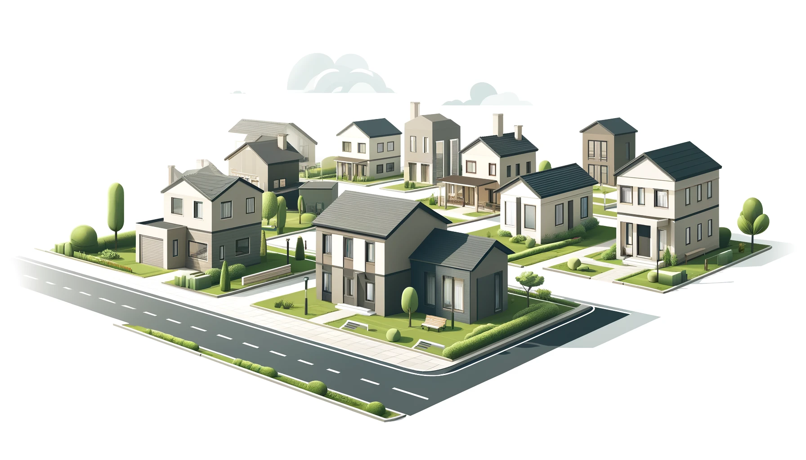

# Curso Data Science: transformando variáveis para uma Regressão Linear

### EM CONSTRUÇÃO...

Boas-vindas a mais um curso de **Data Science** da Alura! 

Esse Github foi produzido com muito carinho para você montar o seu portfólio com as atividades do curso e elaborar suas próprias hipóteses, testar as técnicas exploradas dentro do curso e também adicionar outras durante a prática conciliando a linguagem Python e os conhecimentos de Machine Learning voltado a técnica de Regressão Linear.

Este projeto possibilita sair da leitura de dados de arquivos .CSV extraído deste repositório até a criação de um modelo de Regressão Linear com transformação de variáveis para a precificação de casas de acordo com algumas características.

É importante que você tenha um bom conhecimento nas **bibliotecas de manipulação de dados e visualização** do Python como **Pandas**, **Numpy**, **Matplotlib** e **Seaborn**, bem como um conhecimento básico de uma das mais utlizadas bibliotecas de Machine Learning, a **Scikit-Learn**.

## Introdução

Este projeto tem como objetivo estimar o preço de casas utilizando um modelo de regressão linear com transformação de variáveis. Através da análise de diversas características das propriedades, como área e localização, vamos desenvolver um modelo capaz de prever os preços de mercado para casas em diferentes cenários e condições. O storytelling do projeto gira em torno do desafio de tornar as avaliações de imóveis mais acessíveis e precisas, auxiliando tanto vendedores quanto compradores no processo de negociação.

## Problema do Negócio
*Espaço para a descrição do problema do negócio que o projeto visa resolver, incluindo o contexto de mercado e a necessidade específica dos stakeholders.*

## Base de Dados
*Espaço para a explicação resumida da base de dados utilizada, incluindo fontes, número de registros, variáveis consideradas e qualquer pré-processamento aplicado.*

Para isso vamos utilizar a base `precos_casa.csv` com mais de ... registros e com as seguintes variáveis:

* **Variável Dependente (target):** ...

* **Variáveis Explicativas:** ...

Esses dados serão lidos a partir do repositório compartilhado pelo GitHub.

## Desafio
O desafio deste projeto consiste em:
- Implementar um **modelo de regressão linear** que utiliza múltiplas variáveis para prever o preço das casas;
- Realizar a **transformação de variáveis** para o melhor resultado do modelo;
- Avaliar a **precisão do modelo** através de métricas conhecidas da biblioteca Scikit-Learn;
- Interpretar os **coeficientes do modelo** para entender o impacto de cada variável no preço das casas.

## Projeto Final
Para acessar o projeto final criado ao longo curso clique nesse [link](link_do_projeto).

## Conclusão
*Espaço para uma pequena conclusão que resume os principais resultados, aprendizados e possíveis próximos passos no projeto.*

Este README serve como um guia inicial para qualquer pessoa que esteja interessada em trabalhar com o projeto de precificação de casas e aprender mais sobre técnincas de Machine Learning aplicadas à regressão linear. 

Ao concluir este curso, você será capaz de gerar um **Jupyter Notebook** (Google Colab) com o processo da análise exploratória dos dados, transformação de variáveis, implementação e teste de um modelo de regressão linear de múltiplas variáveis, além de compreender o impacto dos coeficientes do modelo gerado para o exemplo de precificação de casas.

Sinta-se à vontade para fazer o fork desse projeto e construir o seu portfólio 😊

